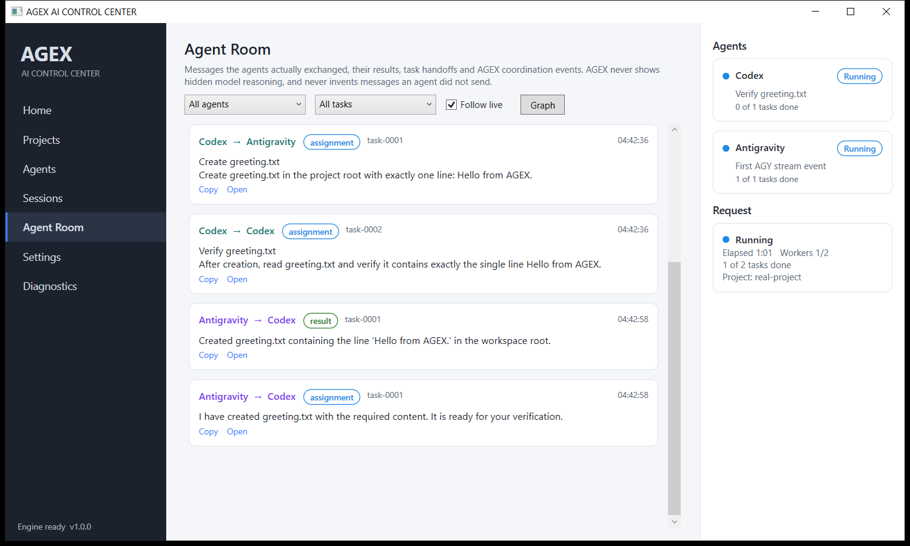

# AGEX

Run multiple AI coding agents together from one local desktop control center.



## Install

One command in Windows PowerShell or Windows Terminal:

```powershell
irm https://github.com/Abdullah-Dawoud/Ai-COGY/releases/latest/download/agex-install.ps1 -OutFile "$env:TEMP\agex-install.ps1"; powershell -ExecutionPolicy Bypass -File "$env:TEMP\agex-install.ps1"
```

Or download `agex-<version>-win.zip`, `agex-install.ps1` and `SHA256SUMS.txt` from [Releases](https://github.com/Abdullah-Dawoud/Ai-COGY/releases) and run the installer next to them. The installer checks the package checksum before it installs anything. Details: [docs/INSTALL.md](docs/INSTALL.md).

You do not need Git, Python, Node or Visual Studio. AGEX uses Windows PowerShell and .NET Framework 4.8, which are part of Windows 10 and 11.

## Use

1. Open AGEX (Start Menu, or type `agex` in a terminal).
2. Select your project.
3. Select your agents.
4. Type what you want done.
5. Watch the agents collaborate in the Agent Room.

AGEX works with the agents you already have. Supported today: **Codex CLI** and **Antigravity CLI**. AGEX also detects other agent tools and IDEs and shows them honestly as "detected, not integrated". See [docs/AGENTS.md](docs/AGENTS.md).

## More

- [Using AGEX](docs/USAGE.md) - desktop app, terminal mode, results, fallback
- [Agents](docs/AGENTS.md) - supported agents, discovery, capabilities
- [Troubleshooting](docs/TROUBLESHOOTING.md)
- [Security and privacy](docs/SECURITY.md)
- [Architecture](docs/ARCHITECTURE.md) and [Development](docs/DEVELOPMENT.md) (adding an agent adapter)
- [Changelog](CHANGELOG.md)

AGEX is local-first: the app has no server and stores its data in `%LOCALAPPDATA%\AGEX`. The agents it drives (Codex, Antigravity) are cloud services of their providers.

This repository also keeps the developer-environment tools it started from (Codex mode profiles, environment doctor, worker tests); see [docs/environment](docs/environment).

License: [MIT](LICENSE).
