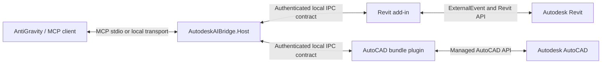

# Autodesk AI Bridge architecture

Revit transport threads enqueue typed requests. `ExternalEvent` drains the queue on Revit's API thread. Every model edit runs inside a named `Transaction`; failed edits roll back.

AutoCAD requests enter `ExecuteInCommandContextAsync`, then use `DocumentLock` and `Transaction` for database writes. Autodesk API assemblies stay outside redistribution packages and resolve through MSBuild properties.

This worker owns integration source templates, diagnostics UI, installer source, and documentation. MCP host transport, shared protocol, and full tool catalog remain separate components.

## Installed user flow

The release installer places self-contained Host and Bridge Manager binaries under the per-user application directory. It creates one per-user IPC secret and pipe name under local application data. Host and Autodesk plug-ins read the same settings automatically; users never enter them.

Bridge Manager discovers AntiGravity configuration locations instead of assuming one vendor-specific path. It backs up existing JSON, merges only the `autodesk-ai-bridge` server, writes atomically, verifies the result, and restores the backup on failure. The MCP entry starts Host with `--stdio`, so AntiGravity remains the only user-facing chat interface.

Autodesk API assemblies stay outside the public package. Revit builds are version-specific. AutoCAD uses a supported per-user bundle location. Installer repair repeats discovery and owned-file installation without touching unrelated Autodesk or AntiGravity data.
